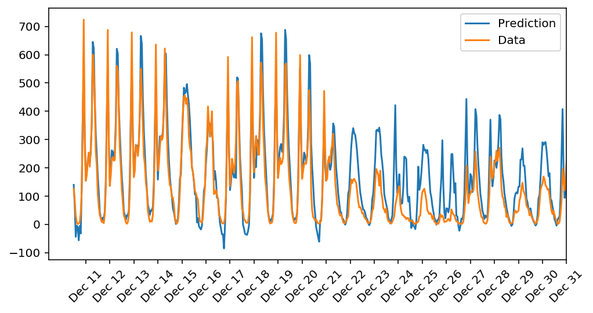
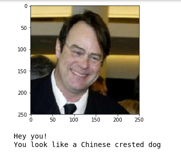
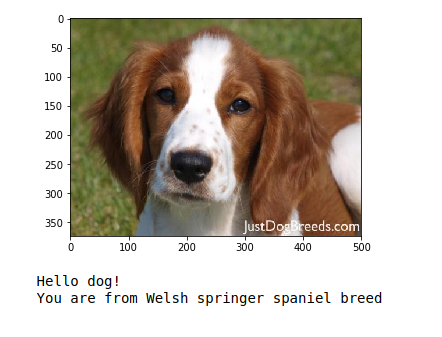
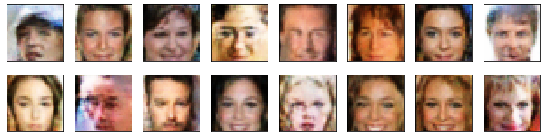
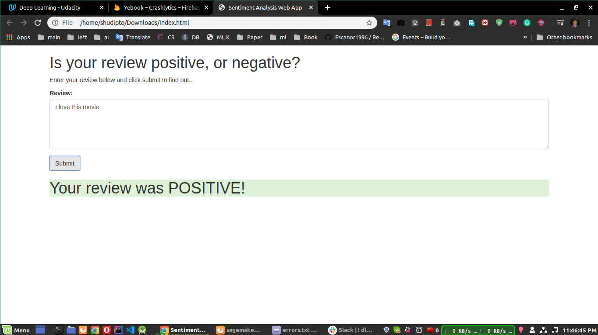

# Udacity Deep Learning Nanodegree
This project was done as a part of My Udacity Deep Learning NanoDegree.

## Projects
1. Predicting Bike-Sharing Patterns ([Project Link](https://github.com/Iamsdt/UdacityDeepLearningNanodegree/tree/master/projects/first_neural_network-269560))
2. Project: Write an Algorithm for a Dog Identification App ([Project Link](https://github.com/Iamsdt/UdacityDeepLearningNanodegree/tree/master/projects/Dog-Breed_Classifier))
3. Project: TV Script Generation ([Project Link](https://github.com/Iamsdt/UdacityDeepLearningNanodegree/tree/master/projects/project_tv_script_generation))
4. Project: Face Generation ([Project Link](https://github.com/Iamsdt/UdacityDeepLearningNanodegree/tree/master/projects/project-face-generation))
5. Project: Creating a Sentiment Analysis Web App ([Project Link](https://github.com/Iamsdt/UdacityDeepLearningNanodegree/tree/master/projects/project_deployment_sentiment))

## Project Description

### Project 1: Predicting Bike-Sharing Patterns

The goal of this project is to **predict daily bike rental ridership**. In this project, neural network was created from scratch using python and the used dataset contains the number of riders for each hour of each day from January 1, 2011, to December 31, 2012. 

#### Output



### Project 2: Write an Algorithm for a Dog Identification App

In this project, the first goal is to develop an algorithm that could detect human and dog and this could be used as a part of a mobile or web app. The idea is accept any user-supplied image as  input and predict the output.  If a dog is detected in the image, it will provide an estimate  of the dog's breed.  If a human is detected, it will provide an estimate of the dog breed that is most resembling.
#### Output




### Project 3: TV Script Generation

In this project, [Seinfeld](https://en.wikipedia.org/wiki/Seinfeld) TV scripts was generated using RNNs. You'll be using part of the [Seinfeld dataset](https://www.kaggle.com/thec03u5/seinfeld-chronicles#scripts.csv) of scripts from 9 seasons. The Neural Network you'll build will  generate a new ,"fake" TV script, based on patterns it recognizes in  this training data.

#### Example

```
jerry:(picks up his hands)

jerry:(pointing) i don't know, i just had a little problem with it, but i was just thinking of the only one. i just got a lot of money.

kramer: well, i just got it.

jerry: oh, well, i was wondering...

jerry:(to george) you know, i was just trying to do something.

jerry: i know......

elaine: oh, well, you know, if i don't get it, i was just thinking of my friend.(kramer enters.)

elaine: oh, yeah.

jerry: what about you?

jerry: well, i'm not really getting married.

jerry:(to george) you know, i was just thinking of a lot of a lot, but i don't want to go out with the other line and you have to see you, but, i'm just getting the hell out of here and i was wondering, you know, i just had a little more more in the car, but i don't want it.

jerry: i don't know. you know, it's a little nervous. i just don't have the directions.

jerry: well, i think i was going out to tell you how i have some trouble with a woman that you can be able to get back to a little.

george: well, i think i'm not going to tell you what i'm going.

george:(pointing at jerry) i think i can do that....(kramer is laughing. george is at george, he exits)

jerry: i know what happened, i don't think it's a good idea.

kramer: well, i think you should have done it.

kramer: yeah, yeah, i think i'll have a little more.

george: you got a big deal with me?

george: i can't believe that. you don't want it to do that. i think
```

### Project 4: Face Generation

In this project, a **DCGAN** was trained on a dataset of faces. And the goal is to get a generator network to generate *new* images of faces that look as realistic as possible!

#### Output


### Project 5: Creating a Sentiment Analysis Web App

The goal of this project is to create a simple web page which a user can use to enter a movie review. The web page will then send the review off to our  deployed model (**AWS**) which will predict the sentiment of the entered review.

#### Output



### License

This project is under [Apache License 2.0]( https://github.com/Iamsdt/UdacityDeepLearningNanodegree/blob/master/LICENSE ).