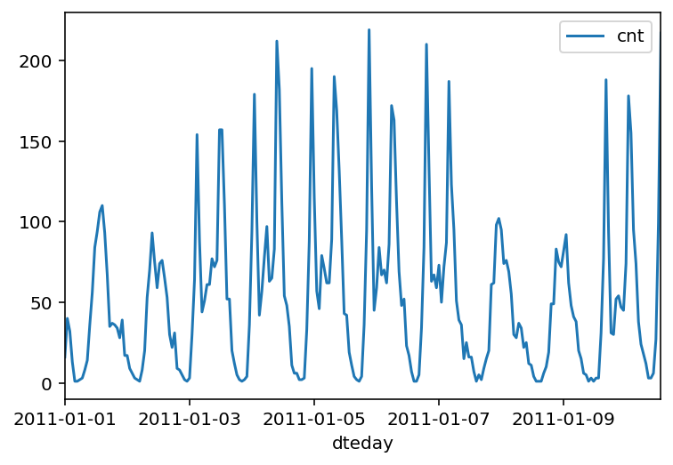
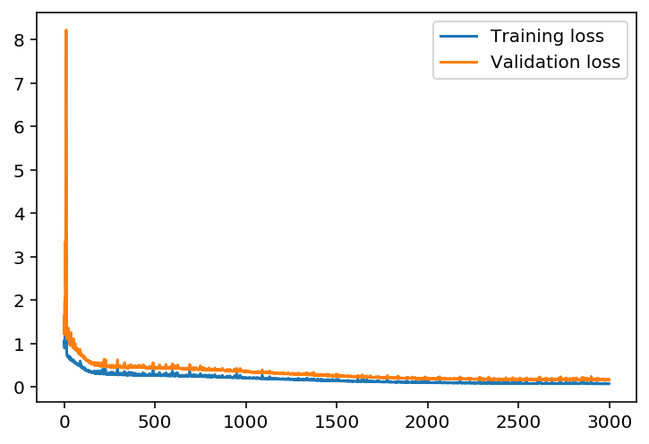
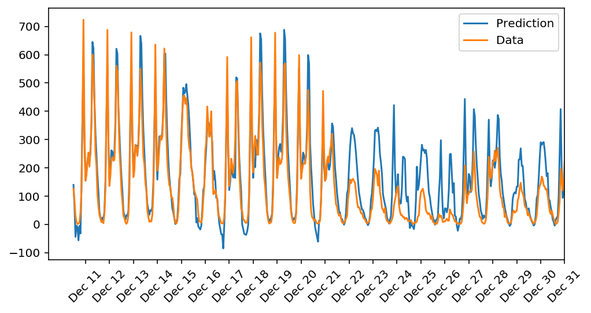

# Project: Predicting Bike-Sharing Patterns

The goal of this project is to **predict daily bike rental ridership**. In this project, neural network was created from scratch using python and the used dataset contains the number of riders for each hour of each day from January 1, 2011, to December 31, 2012. 

### Example Data

### Key points:

All the algorithms are implemented using python.

- Gradient descent algorithm
- Backpropagation algorithm
- Sigmoid activation function

### Training Loss

## Predictions
